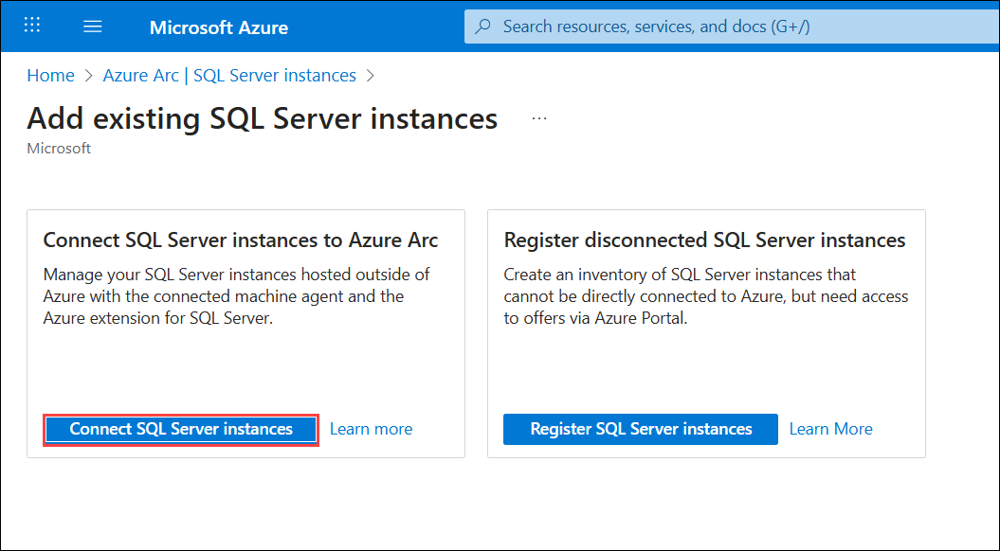
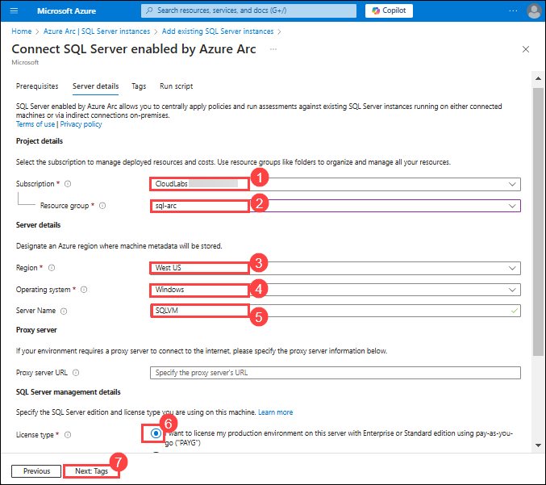
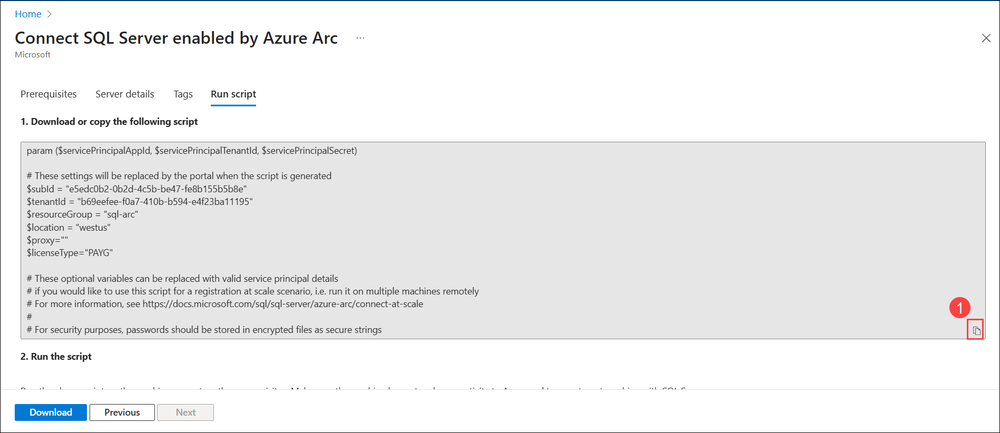
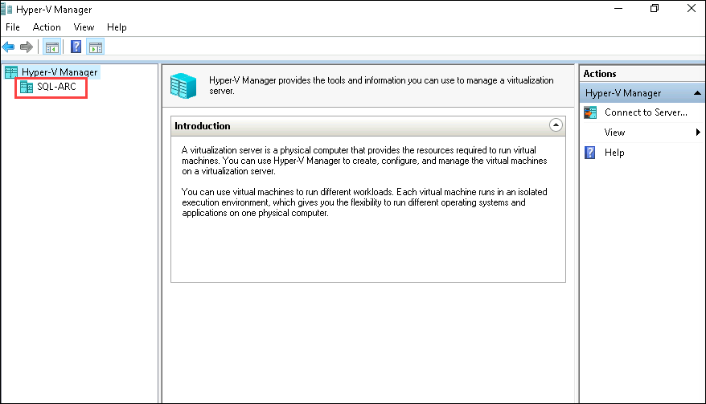
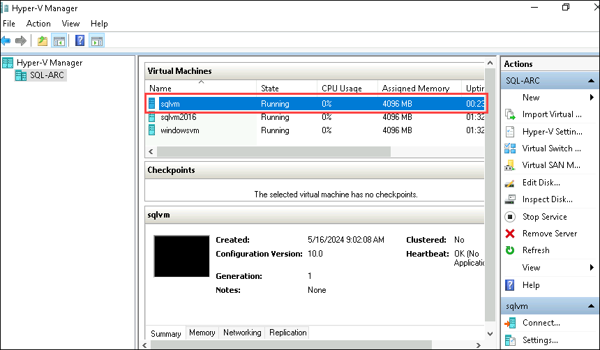
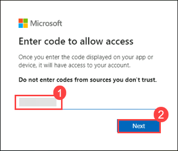
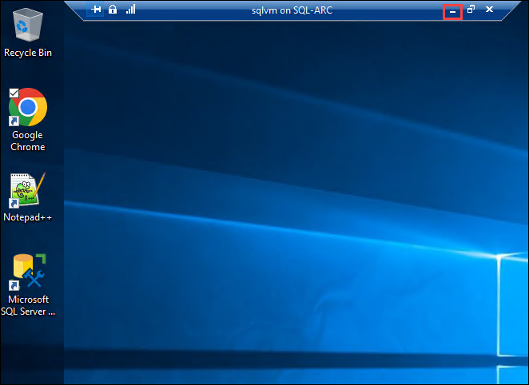
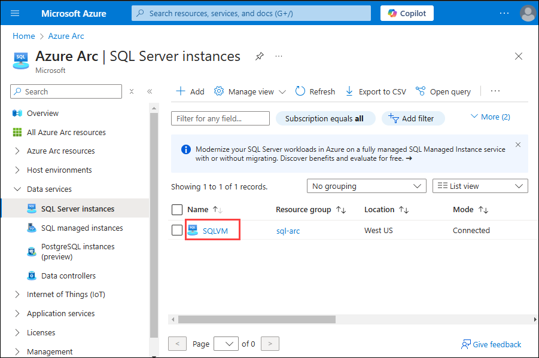
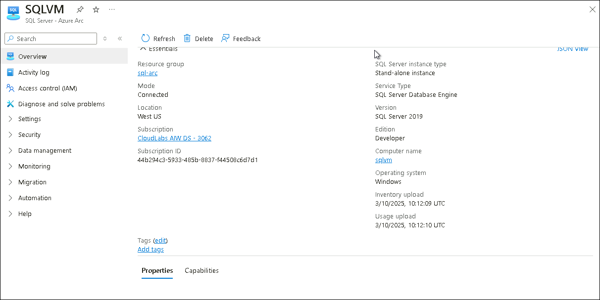

# Exercise 1: Onboard the On-prem SQLServer to Azure Arc-enabled SQL Server 

### Estimated Duration: 90 minutes
 
In this exercise, you will onboard an on-premises SQL Server to Azure Arc using Powershell and Azure Portal. First, you need to access the SQL Server virtual machine using Hyper-V Manager and log in to the Azure Portal from within the VM. Then, install the Azure Connected Machine Agent using PowerShell to prepare the server for registration. After that, run the Arc registration script to connect the on-prem SQL Server to your Azure environment. Finally, complete the setup by registering the SQL Server with Azure Arc, enabling centralized management and monitoring through the Azure Portal.

## Lab Objectives

In this lab, you will complete the following tasks:

- Task 1: Log in to Azure Portal in SQL Server via Hyper-V Manager
- Task 2: Register Azure Arc-enabled SQL Server
 
## Task 1: Log in to Azure Portal in SQL Server via Hyper-V Manager 
 
In this task, you are going to connect your on-prem Hyper-V SQL Server VM to Azure using Azure Arc, so it can be managed like a native Azure resource. The script installs the Azure Arc SQL extension to enable this connection.

1. In the LabVM click on **Azure Portal** from the desktop to to launch Azure portal, from the search bar at the top search for **SQL Server(1)** and then select **SQL Server - Azure Arc** **(2)**.
  
    
    
1. From the left pane on Azure Arc | SQL Server instances, under Data services select **SQL Server instances**, then click on the **+ Add (2)** to create the **SQL Server- Azure Arc (1)**.  
  
    
    
1. In the Add existing SQL Servers instances page, click on **Connect SQL Server instances**. 
 
    
    
1. In Connect SQL Server enabled by Azure Arc under the Prerequisites tab, you can explore the page and then click on the **Next: Server details** from the bottom. 
     
   > **Note**: We have already completed the prerequisite part for you.  
     
    
    
1. In the **Server details** tab, enter the details below and click on **Next: Tags (7)**:
   
     - **Subscription**: Select the default subscription. **(1)**
     - **Resource group**: Select **sql-arc** from dropdown list. **(2)**
     - **Region**: **<inject key="Region" enableCopy="false"/>(3)**
     - **Operating system**: Select **Windows**. **(4)**
     - **Server Name**: Enter **SQLVM** **(5)**
     - **License Type**: Select **I want to license my production environment on this server with Enterprise or Standard edition using pay-as-you-go ("PAYG")(6)**
      
      
         
1. In the Tags tab keep it default and click on **Next: Run script**.

     
  
1. In the **Run script** tab, explore the given script under **Download or copy the following script**. Then copy the script by clicking **Copy to Clipboard**, paste the code into the notepad. Later we will be using this PowerShell script to **Register Azure Arc enabled SQL Server**.  
       
       

1. Minimize the Browser window.  

1. In the **LABVM**, on the **Windows Search bar**, search for **Hyper-v** and select **Hyper-V Manager**. 
 
       
 
1. From the left pane select **SQL-ARC** to connect with the Local Hyper-V server. 
 
       
 
1. On the Hyper-V manager, under Virtual Machines you will find multiple guest virtual machines available. Open **sqlvm** by double clicking on it.
 
        

   >**Note**: Please start the **sqlvm** if it is stopped state from the right pane.
 
1. From the pop up Connect to sqlvm click on the **Connect**. 
 
       
 
1. Enter the password **demo@pass123** and press **Enter** to login. Feel free to resize the sqlvm window as your convenience. 
 
       
             
## Task 2: Register Azure Arc-enabled SQL Server
  
1. From the start menu of the sqlvm, search for **powerShell (1)**, right click on **Windows PowerShell ISE (2)** and select **Run as administrator (3)**. 
  
    
   
1. In Windows PowerShell ISE, click on **Show Script Pane**. 
  
            
 
1. Paste the script which was copied in **Task 1 Step 7** in **Script Pane (1)** and click on **Run Script (2)**. 
 
      
      
1. After running the command, you will see some outputs which show that the script started running. 
   
     
 
1. Copy the **authenticate code**. 
 
     
 
1. In Hyper-v VM, use a web browser to open the page **https://microsoft.com/devicelogin**, enter the **authenticate code (1)** and click on **Next (2)**.  
 
     
  
1. On the **Sign in** tab, you're signing in to **Microsoft Azure Cross-platform Command Line Interface**. Enter the following **Email/Username (1)** and then click on **Next (2)**.  
   * Email/Username: <inject key="AzureAdUserEmail"></inject> 
   
       
    
1. Now, enter the **Password (2)** that you have already received for the above account, and click on **Sign in (2)** 
      
   * Password: <inject key="AzureAdUserPassword"></inject> 

      
      
1. Are you trying to sign into Microsoft Azure CLI? Click on **Continue** and minimize the Browser window. 
 
     
 
1. In 5-10 minutes, you will see that the script execution is completed. Make sure that you see the following output: ```SQL Server is successfully installed``` 
 
     

1. **Minimize** the sqlvm on SQL-ARC Hyper-V.   

     

1. Go back to the browser window where you had opened Azure Portal and search for **SQL Server -Azure Arc**. If you are already on that page, you will need to click on the **Refresh button**. On that page, you will see one resource **SQLVM** that we just created using the PowerShell script in the previous step. ***update sss**
 
     

    > **Note**: If you are not able to view **SQLVM** SQL Server instances wait for 5 minutes and keep refreshing the page.
   
1. Select the **SQLVM** resource and now you can see the Overview of **SQLVM** SQL Server -Azure Arc from Azure Portal. 
 
        

    <validation step="f00aaa9f-7a98-4314-9310-a1fcd61130aa" />


## Summary

In this exercise, you onboarded an on-prem SQL Server to Azure Arc using PowerShell commands to Azure Portal

Now, click on **Next >>** from the lower right corner to move on to the next exercise.


