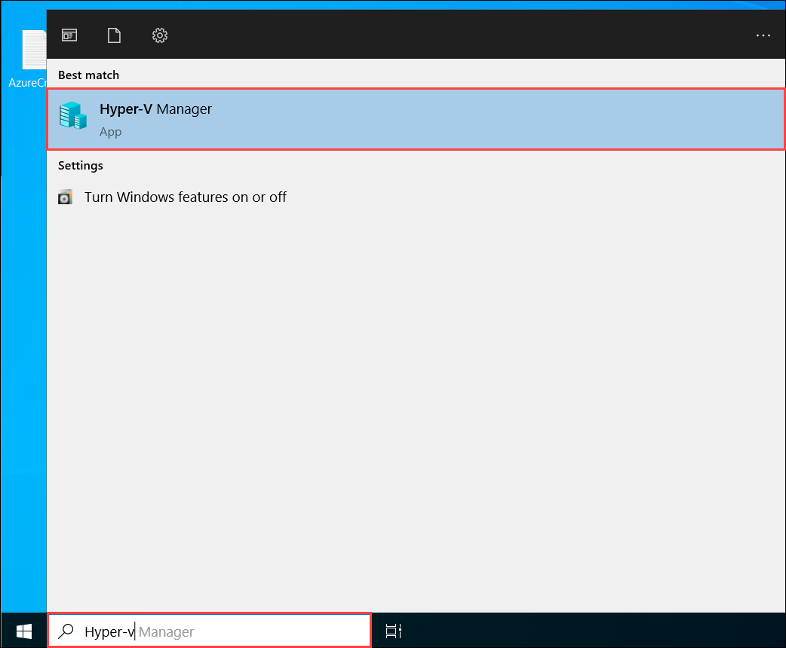
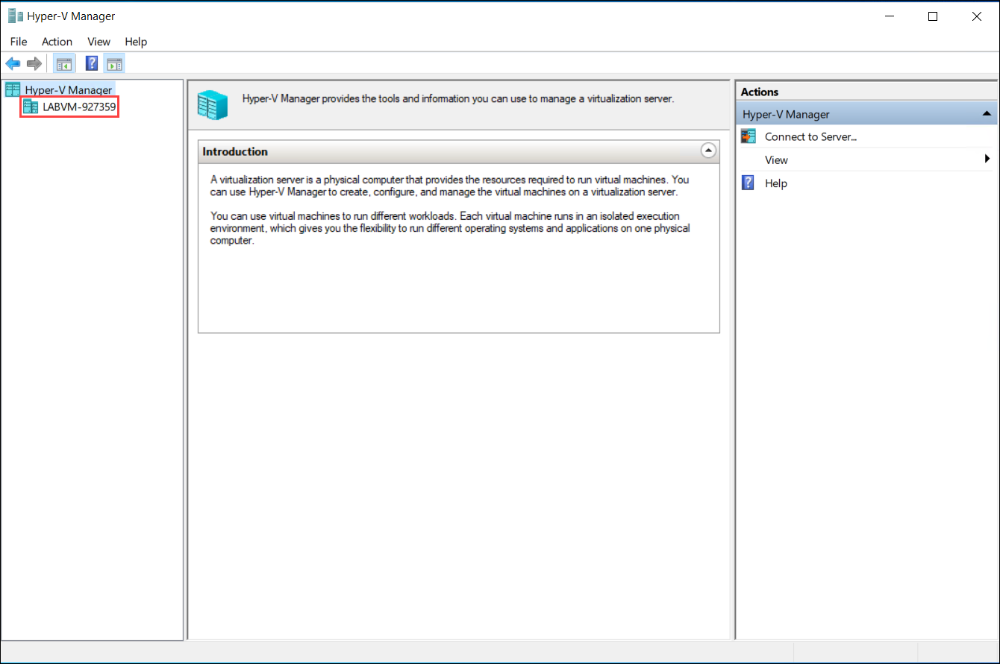
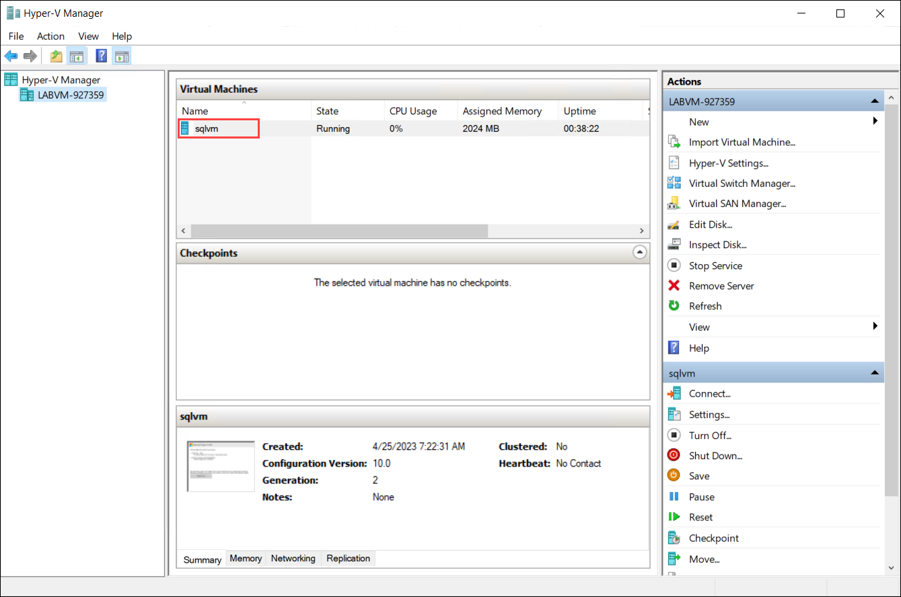
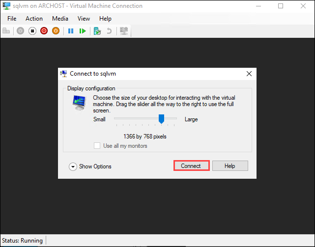
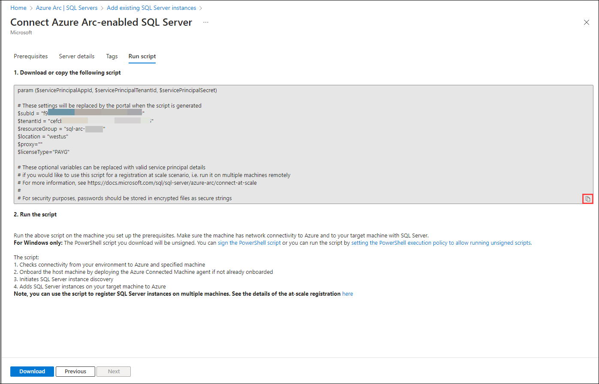
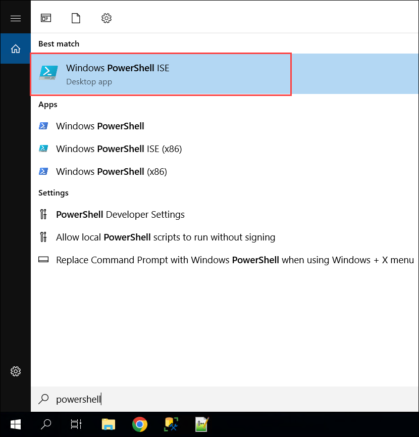
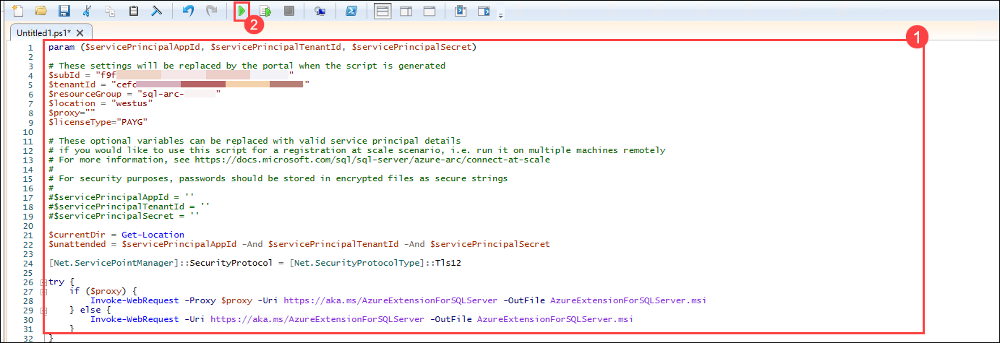
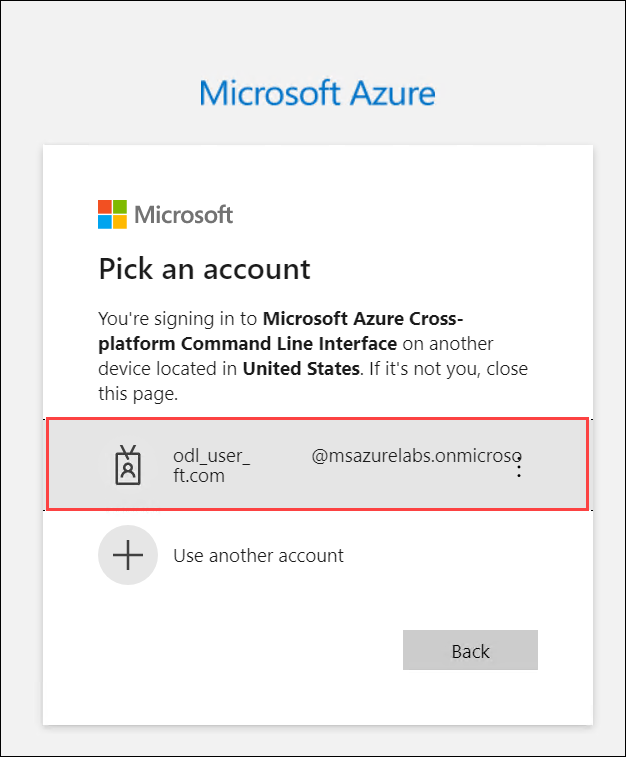

# Hands-On-Lab: Azure Arc enabled SQL Server 
 
In this exercise, you will onboard SQL Server to Azure Arc using PowerShell commands to Azure Portal. 
 
## Task 1: Login to Azure Portal in SQL Server via Hyper-V Manager 
 
1. From the start menu of the LAB VM, search for **Hyper-V Manager**. 
 
       
 
1. Then, you need to Select LABVM-<inject key="DeploymentID/Suffix" enableCopy="false"/> to connect with the Local Hyper-V server. 
 
       
 
1. On the Hyper-V manager, you will find one guest virtual machine **sqlvm**. 
 
       
       
1. Open **sqlvm** from the Hyper-V Manager by double clicking on **sqlvm**. 
 
        
 
1. Connect to sqlvm box, and then click on **Connect** button. 
 
       
 
1. Type password **demo@pass123** and press **Enter** button to login. Then, you can resize the sqlvm window size as per your convenience. 
 
       
       
1. In **sqlvm** select chrome browser and navigate to [https://portal.azure.com/](https://portal.azure.com/)       
 
1. On the **Sign into Microsoft Azure** tab, you will see the login prompt. Enter the following **Email/Username** and then click on **Next**.  
   * Email/Username: <inject key="AzureAdUserEmail"></inject>

      
    
1. Now, enter the **Password** which you have already received for the above account. 
      * Password: <inject key="AzureAdUserPassword"></inject> 

         
       
1. If you see the pop-up **Stay Signed in?**, click No 
       
1. Click on the search blade at the top and search for ```SQL Server```, select **SQL Server - Azure Arc**. 
  
    
    
1. Click on the **Add** button to create the **SQL Server- Azure Arc**.  
  
    
    
1. In the Adding existing SQL Servers instances page, click on **Connect Servers**. 
 
    
    
1. You will now see the prerequisite page. You can explore the page and then click on the **Next: Server details** option. 
     
   > **Note**: We have already completed the prerequisite part for you.  
     
    
    
1. On the **Server Details** blade, enter the details below. 
  
   - Subscription: Leave the default- Resource group: Select **sql-arc-**<inject key="DeploymentID/Suffix" enableCopy="false" />**** from dropdown list. 
   - Region: Select the same region as the Resource group. 
   - Operating Systems: Select **Windows**. 
   - License Type: Select **Paid - Standard or Enterprise edition license with Software Assurance or SQL Subscription**. 
 
     Now, click on the **Next: Tags** button. 
    
    
    
1. Leave the default for tags blade and click on **Next: Run Script** button. 
  
1. On the **Script** blade, explore the given script, copy the script by clicking **Copy to Clipboard** paste the code into the notepad. We will be using this PowerShell script to **Register Azure Arc enabled SQL Server** later.  
       
       
    
## Task 2: Register Azure Arc-enabled SQL Server. 
 
1. Minimize the Azure Portal Browser window.  
 
1. From the start menu of the LAB VM, search for **PowerShell**, and select **Windows PowerShell ISE**. 
  
    
   
1. In Windows PowerShell ISE, click on **Show Script Pane**. 
  
            
 
1. The script you copied on **step 17 of task 1** must be pasted in **Script Pane** and clicked on **Run Script**. 
 
        
      
1. After running the command, you will see some outputs which show that the script started running. 
   
    
 
1. Copy the **authenticate code**. 
 
       
 
1. To sign in, use a web browser to open the page **https://microsoft.com/devicelogin** and enter the **authenticate code** and click on **Next**.  
 
       
  
1. Once you in **Pick an account**, select your account. 
 
       
 
1. In Are you trying to sign into Microsoft Azure CLI? click on **Continue** and minimize the Browser window. 
 
       
 
1. In 5-10 minutes, you will see that the script execution is completed. Make sure that you see the following output: ```SQL Server is successfully installed``` 
 
    
   
1. Bring back the browser window where you had opened Azure Portal and search for **SQL Server -Azure Arc**. If you are already on that page, you will need to click on the Refresh button. On that page, you will see one resource **SQLVM** that we just created using the PowerShell script in the previous step. 
 
    
   
1. Select the **SQLVM** resource and now you can see the dashboard of **SQLVM** SQL Server -Azure Arc from Azure Portal. 
 
       
    
1. Now, click on Next from the lower right corner to move on to the next page.
