# Exercise 2: Onboard the On-prem SQLServer 2012 to Azure Arc-enabled SQL Server 
 
In this exercise, you will onboard SQL Server to Azure Arc using PowerShell commands to Azure Portal. 
 
## Task 1: Log in to Azure Portal in SQL Server via Hyper-V Manager 

1. In the Azure portal, click on the search blade at the top and search for ```SQL Server```. Then select **SQL Server - Azure Arc**. 
  
    
    
1. Click on the **Add** button to create the **SQL Server- Azure Arc**.  
  
   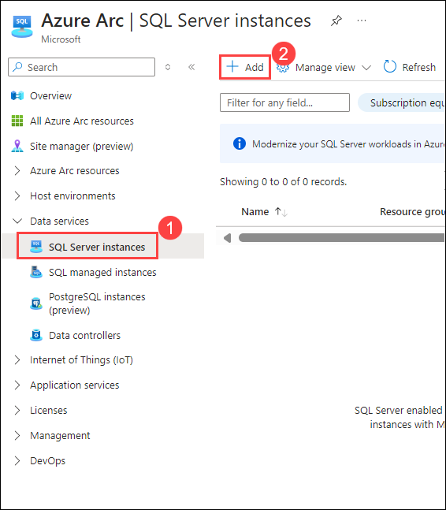 
    
1. In the Adding existing SQL Servers instances page, click on **Connect Servers**. 
 
    
    
1. You will now see the prerequisite page. You can explore the page and then click on the **Next: Server details** option. 
     
   > **Note**: We have already completed the prerequisite part for you.  
     
    
    
1. On the **Server Details** blade, enter the details below. 
  
   - Subscription: Select the default subscription.
   - Resource group: Select **sql-arc** from dropdown list. 
   - Region: **<inject key="Region" enableCopy="false"/>**. 
   - Operating Systems: Select **Windows**. 
   - Server Name: Enter **SQLVM2012**.
   - License Type: Select **I want to license my production environment on this server with Enterprise or Standard edition using pay-as-you-go ("PAYG")**. 
 
     Now, click on the **Next: Tags** button. 
    
    
    
1. Leave the default for tags blade and click on **Next: Run Script** button. 
  
1. On the **Script** blade, explore the given script, copy the script by clicking **Copy to Clipboard** paste the code into the notepad. We will be using this PowerShell script to **Register Azure Arc enabled SQL Server** later.  
       
       

1. Minimize the Browser window.  

1. In the **LABVM**, open the **Start menu** and search for **Hyper-V**. Select **Hyper-V Manager**. 
 
       
 
1. Then, you need to Select LABVM-<inject key="Deployment ID" enableCopy="false"/> to connect with the Local Hyper-V server. 
 
       
 
1. On the Hyper-V manager, you will find multiple guest virtual machines available. 
 
       
       
1. Open **sqlvm2012** from the Hyper-V Manager by double clicking on **sqlvm2012**. 
 
      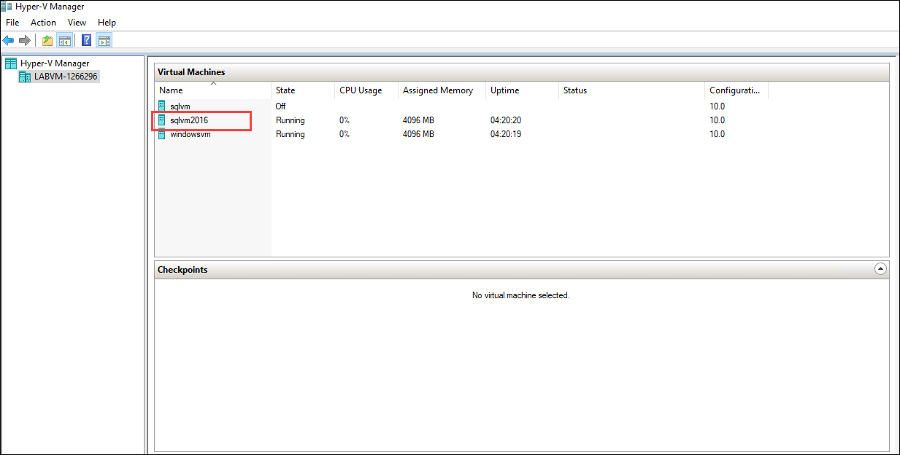  

   >**Note**: Please start the **sqlvm2012** if it is stopped state.
 
1. Connect to the sqlvm2012 box, and then click on the **Connect** button. 
 
       
 
1. Type password **demo@pass123** and press **Enter** button to login. Then, you can resize the sqlvm2012 window size at your convenience. 
 
      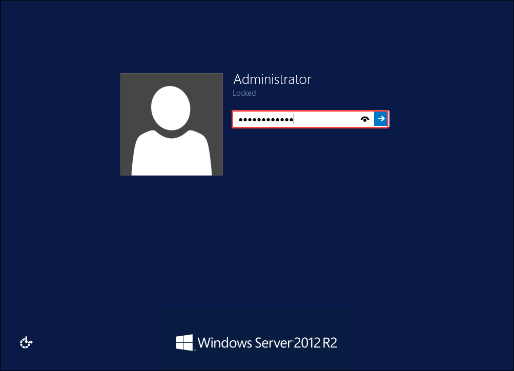

## Task 2: Register Azure Arc-enabled SQL Server. 
  
1. From the Desktop open **Windows PowerShell ISE**. 
  
   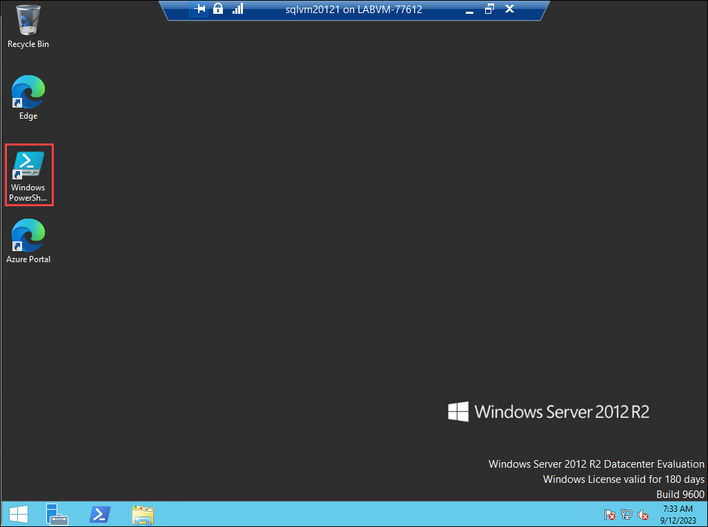 
   
1. In Windows PowerShell ISE, click on **Show Script Pane**. 
  
            
 
1. The script you copied on **step 8 of task 1** must be pasted in **Script Pane** and clicked on **Run Script**. 
 
      
      
1. After running the command, you will see some outputs which show that the script started running. 
   
     
 
1. Copy the **authenticate code**. 
 
     
 
1. In Hyper-v VM, use a web browser to open the page **https://microsoft.com/devicelogin**, enter the **authenticate code** and click on **Next**.  
 
    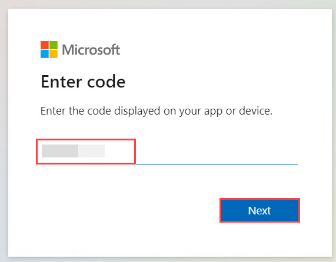 
  
1. On the **Sign in** tab, You're signing in to **Microsoft Azure Cross-platform Command Line Interface**‭. Enter the following **Email/Username** and then click on **Next**.  
   * Email/Username: <inject key="AzureAdUserEmail"></inject>
   
       
    
1. Now, enter the **Password** that you have already received for the above account. 
      
   * Password: <inject key="AzureAdUserPassword"></inject> 

      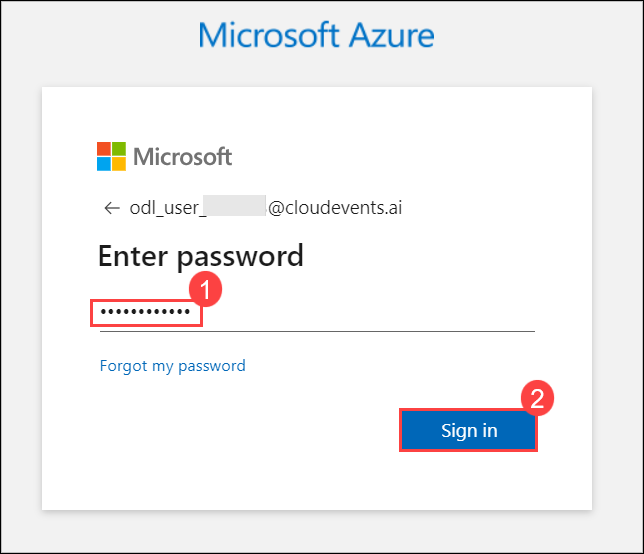
      
1. Are you trying to sign into Microsoft Azure CLI? Click on **Continue** and minimize the Browser window. 
 
     
 
1. In 5-10 minutes, you will see that the script execution is completed. Make sure that you see the following output: ```SQL Server is successfully installed``` 
 
     

1. Minimize the sqlvm2012 on LABVM-<inject key="Deployment ID" enableCopy="false"/>    

    

### Task 3: Enable Best practices assessment  

1. Navigate to the browser tab where the **Azure Portal** is open and search for **SQL Server - Azure Arc**. If you are already on the **SQL Server - Azure Arc** page, you will have to the Refresh tab. On that page, you will see one resource **SQLVM2012** that we just created using the PowerShell script in the previous step. 
 
    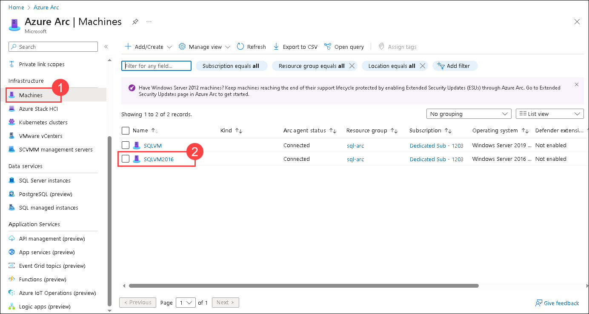 
   
1. Click on **SQL Servres instances** **(1)** under **Data Service** section from left-menu and select the **sqlvm2012_SQLEXPRESS** **(2)** instance. 

   

1. Once you are in **sqlvm2012_SQLEXPRESS** instance, click on **N/A** under Host ESU status. 
 
        

1. In **sqlvm2012 | SQL Server Configuration** blade, select License Type as **Pay-as-you-go** **(1)**, Extended Security Updates as **Subscribe to Extended Security Updates** **(2)**, click on **Save** **(3)** button, and click on **sqlvm2012_SQLEXPRESS** **(4)** under SQL Server Instances.

    

      **Note**: SQL Server Configuration Host license type change will take more than 5 mins. Please wait at least 5 mins to view new values.

1. Once you are in **SQL Server - Azure Arc** blade, click on **Extended Security Updates** under **Settigs** section from left-menu here we can check **Available Security Updates** for SQL Server 2012.

    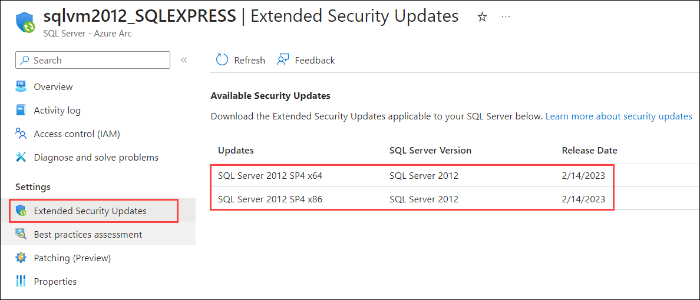

1. Click on **Best practices assessment** **(1)** under **Settigs** section from left-menu, select the **Arc-SQL-workspace-<inject key="Deployment ID" enableCopy="false"/>** **(2)** Log Analytics workspaces from drop-down, and click on **Run assessment**  **(3)**.
   
    

   > **Note**: Please wait while assessment settings are being refreshed. It will initiate and redirect to the deployments page.   

1. Once the deployment is completed move back to the previous tab **SQL Server - Azure Arc**. Once you are in **SQL2012VM_SQLEXPRESS | Best practices assessment** blade, click on **Run assessment**.

    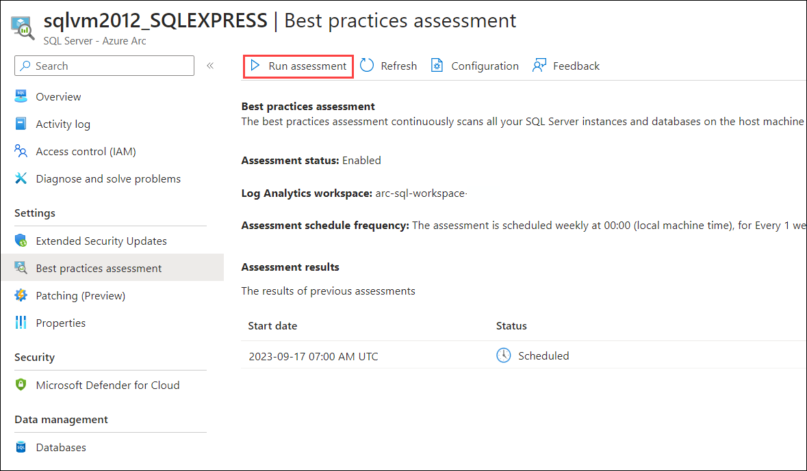

1. Click on the **Refresh** button until assessment status changes to **Partially Succeeded**.

   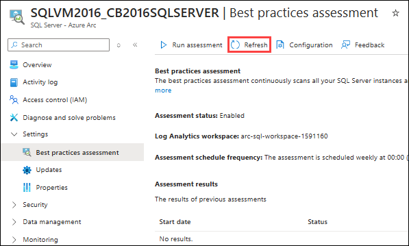

1. Once the assessment results status changes to **Partially Succeeded**, click on the **start date** to view results. 

   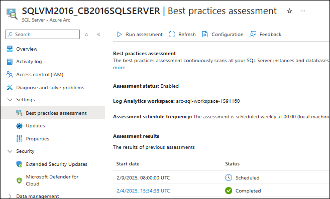

1. On the **SQL best practices assessment results** page you will able to view and explore the assessment result.

   

### Task 4: Enable Microsoft Defender for SQL

1. Navigate to the previous tab **SQL2012VM_SQLEXPRESS | Best practices assessment** by click on **X**, then click on **Microsoft Defender for Cloud** **(1)** under **Security** section from left menu, and click on **Enable Microsoft Defender for SQL** **(2)** button.

   

1. On **Microsoft Defender for Cloud** page, click on **Environment settings** **(1)** from the left menu and expand the **Tenant root group** **(2)**, click on **eclipse** **(3)** button next to your subscriptions, and click on **Edit settings** **(4)**.

   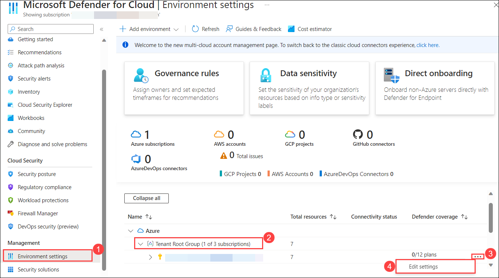

1. On **Settings | Defender plans** page, set the toggle button next to **Databases** to **On** **(1)**, and click on **Save** **(2)**.

    

1. Navigate to **SQL2012VM_SQLEXPRESS | Microsoft Defender for Cloud**, observe that the **Recommendations** and **Security incidents and alerts** are populated.


 **Note**: It might take up to 24 hours for **Recommendations** and **Security incidents and alerts** to populated.

1. Now, click on Next from the lower right corner to move on to the next page.      
