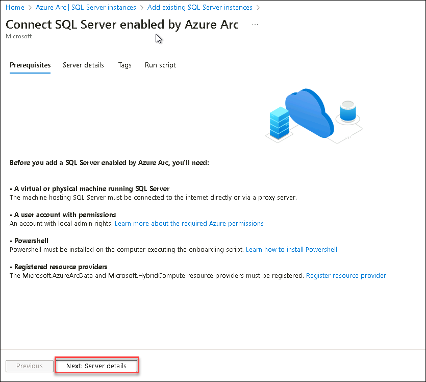
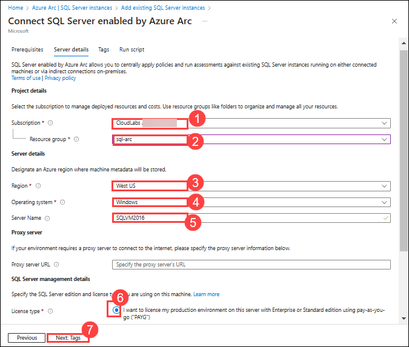
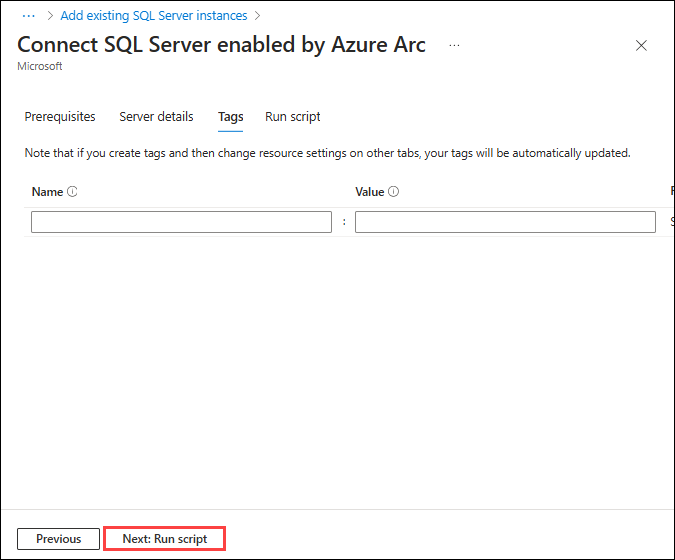
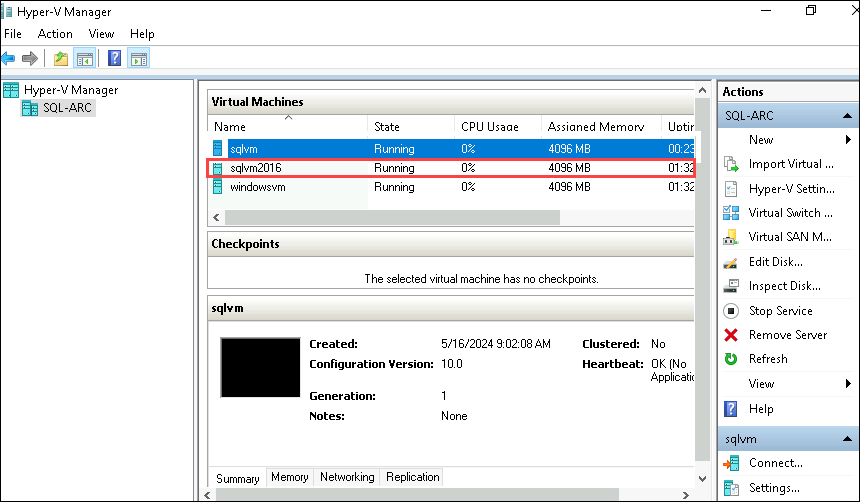
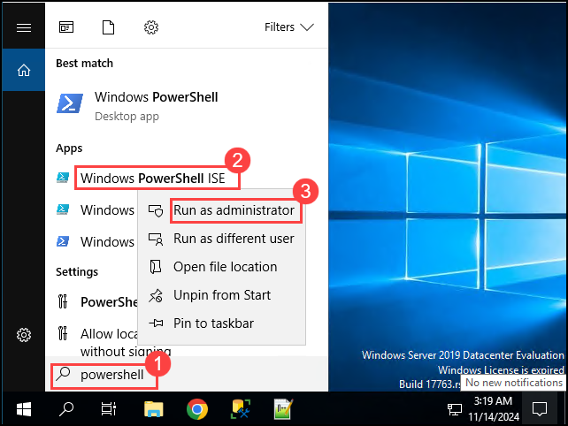
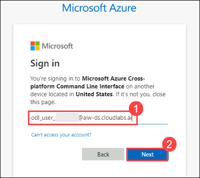
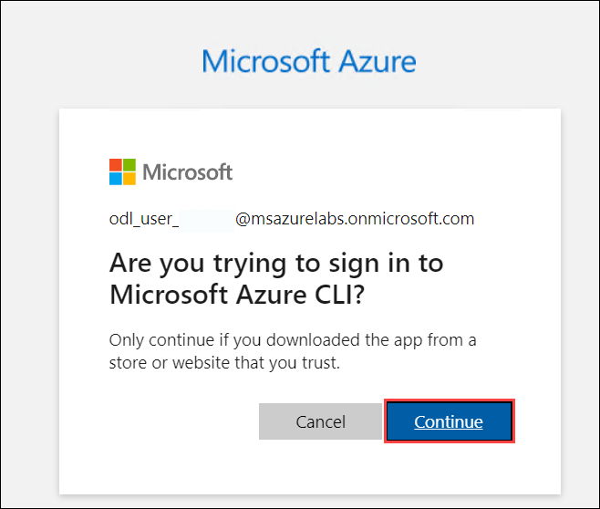
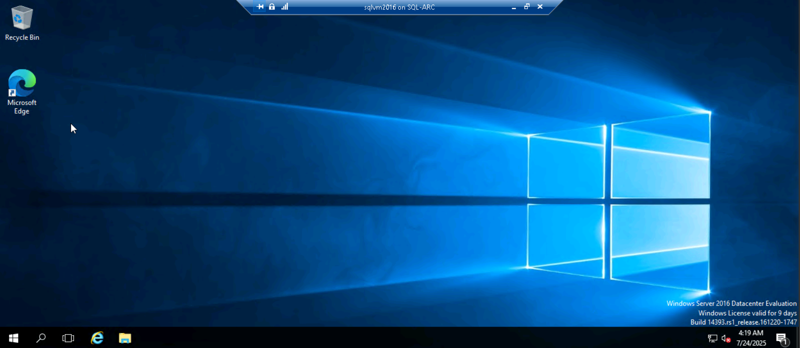
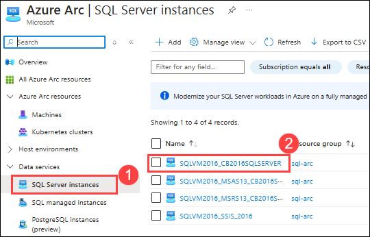
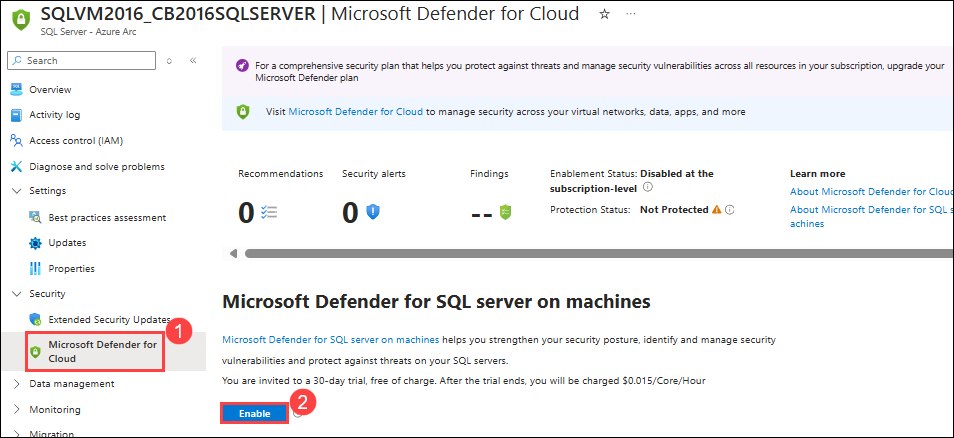

# Exercise 2: Onboard the On-prem SQLServer 2016 to Azure Arc-enabled SQL Server 

### Estimated Duration: 90 minutes
 
In this exercise, you will onboard an on-prem SQL Server to Azure Arc using PowerShell commands to Azure Portal, enable Best practices assessment and Microsoft Defender for SQL.

## Lab Objectives

You will be able to complete the following tasks:

- Task 1: Log in to Azure Portal in SQL Server via Hyper-V Manager
- Task 2: Register Azure Arc-enabled SQL Server
- Task 3: Enable Best practices assessment
- Task 4: Enable Microsoft Defender for SQL
 
## Task 1: Log in to Azure Portal in SQL Server via Hyper-V Manager 

In this task, you are going to connect your on-prem Hyper-V SQL Server VM to Azure using Azure Arc, so it can be managed like a native Azure resource. The script installs the Azure Arc SQL extension to enable this connection.

1. In the Azure portal, click on the search tab at the top and search for **SQL Server(1)**, then select **SQL Server - Azure Arc(2)**. 
  
    
    
1. From the left pane on Azure Arc | SQL Server instances, under Data services select **SQL Server instances**, then click on the **+ Add (2)** to create the **SQL Server- Azure Arc (1)**.  
  
   
    
1. In the Add existing SQL Servers instances page, click on **Connect SQL Servers instances**. 
 
    
    
1. In Connect SQL Server enabled by Azure Arc explore the Prerequisites tab and then click on the **Next: Server details**. 
     
   > **Note**: We have already completed the prerequisites part for you.  
     
    
    
1. On the **Server Details** tab, enter the details below. 
  
     - **Subscription**: Select the default subscription. **(1)**
     - **Resource group**: Select **sql-arc** from dropdown list.**(2)**
     - **Region**: **<inject key="Region" enableCopy="false"/>(3)**
     - **Operating Systems**: Select **Windows(4)**
     - **Server Name**: Enter **SQLVM2016(5)**
     - **License Type**: Select **I want to license my production environment on this server with Enterprise or Standard edition using pay-as-you-go ("PAYG")(6)**
     - Now, click on the **Next: Tags (7)** button. 
    
    
    
1. In the Tags tab keep it default and click on **Next: Run script**.

   
  
1. In the **Run script** tab, explore the given script under **Download or copy the following script**. Then copy the script by clicking **Copy to Clipboard**, paste the code into the notepad. Later we will be using this PowerShell script to **Register Azure Arc enabled SQL Server**.  
       
       

1. Minimize the Browser window.  

1. In the **LABVM**, open the **Start menu** and search for **Hyper-v**. Select **Hyper-V Manager**. 
 
       
 
1. Then, you need to Select **SQL-ARC** to connect with the Local Hyper-V server. 
 
       
 
1. In the Hyper-V manager, under Virtual Machines you will find multiple guest virtual machines available. Open **sqlvm2016** from the Hyper-V Manager by double clicking on **sqlvm2016**.
 
        

   >**Note**: Please start the **sqlvm2016** if it is stopped state.
 
1. In the pop up Connect to the sqlvm2016 click on **Connect**. 
 
       
 
1. Enter the password **demo@pass123** and press **Enter** button to login. Feel free to resize the sqlvm2016 window as your convenience. 
 
      

## Task 2: Register Azure Arc-enabled SQL Server

 In this task you will be registering an Azure Arc-enabled SQL Server which connects your on-premises SQL Server instance to Azure for centralized management. 
 
1. From the start menu of the sqlvm2016, search for **powerShell (1)**, and right click on **Windows PowerShell ISE (2)** and select **Run as administrator (3)**.
  
    
   
1. In Windows PowerShell ISE, click on **Show Script Pane**. 
  
            
 
1. Paste the script which was copied in **Task 1 Step 7** in **Script Pane(1)** and click on **Run Script (2)**. 
 
      
      
1. After running the command, you will see some outputs which show that the script started running. 
   
     
 
1. Copy the **authenticate code**. 
 
     
 
1. In Hyper-v VM, use a web browser to open the page **https://microsoft.com/devicelogin**, then enter the **authenticate code (1)** and click on **Next (2)**.  
 
     
  
1. On the **Sign in** tab, You're signing in to **Microsoft Azure Cross-platform Command Line Interface**. Enter the following **Email/Username (1)** and then click on **Next (2)**.  
   * Email/Username: <inject key="AzureAdUserEmail"></inject>
   
       
    
1. Now, enter the **Password (1)** that you have already received for the above account and click on **Sign in (2)** 
      
   * Password: <inject key="AzureAdUserPassword"></inject> 

      
      
1. Are you trying to sign into Microsoft Azure CLI? Click on **Continue** and minimize the Browser window. 
 
     
 
1. In 5-10 minutes, you will see that the script execution is completed. Make sure that you see the following output: **SQL Server is successfully installed** 

     

1. Minimize the sqlvm2016 on SQL-ARC VM. 

    

## Task 3: Enable Best practices assessment

In this task you will learn to enable best practices assessment for an Azure Arc-enabled SQL Server by linking it to a Log Analytics workspace. This allows us to analyze the SQL Server configuration and provide health and optimization recommendations.

1. Navigate to the browser tab where the **Azure Portal** is open and search for **SQL Server - Azure Arc**.
   
1. In Azure Arc | SQL Server instances click on **SQL Servers instances** **(1)** under **Data Service** section from left-menu and select the **SQLVM2016_CB2016SQLSERVER** **(2)** instance. 

   

   > **Note**: If you are not able to view **SQLVM2016_CB2016SQLSERVER** SQL Server instances wait for 15-20 minutes and keep refreshing the page.

1. Click on **Best practices assessment(1)** under **Settings** section from left-menu, from Log Analytics workspaces select the **Arc-SQL-workspace-<inject key="Deployment ID" enableCopy="false"/>(2)** from drop-down, and click on **Enable assessment(3)**.
   
    
   
   > **Note**: Please wait while assessment settings are being refreshed. It will initiate and redirect to the deployments page.   

1. Once the deployment is completed move back to the previous tab **SQL Server - Azure Arc** by clicking on **X** from the top right corner page of the deployments page. Once you are in **SQLVM2016_CB2016SQLSERVER | Best practices assessment** tab, click on **Run assessment**.

    

1. Click on the **Refresh** button until assessment status changes to **Partially Succeeded**. It may take up to 5 to 10 minutes.

   

1. Once the assessment results status changes to **Partially Succeeded** or **Succeeded** , click on the **start date** to view results. 

   

1. On the **SQL best practices assessment results** page you will able to view and explore the assessment result.

   

## Task 4: Enable Microsoft Defender for SQL

in this task we are going to enable Microsoft Defender for SQL to provide advanced threat protection for Azure Arc-enabled SQL Servers. Once enabled, it starts showing security recommendations, incidents, and alerts.

1. Navigate to the previous tab **SQLVM2016_CB2016SQLSERVER | Best practices assessment** by click on **X**, then click on **Microsoft Defender for Cloud** **(1)** under **Security** section from left menu, and click on **Enable** **(2)** button.

   

   > **Note:** Skip this step if Microsoft Defender for Cloud is already enabled for your subscription.

1. On Microsoft Defender for Cloud page, click on **Environment settings** **(1)** under **Management** from the left menu and expand the **Tenant root group** **(2)**, click on **eclipse** **(3)** button next to your subscriptions, and click on **Edit settings** **(4)**.

   

1. On **Settings | Defender plans** page, set the toggle button next to **Databases** to **On** **(1)** and then click on **Save** **(2)**.

    

1. Navigate to **SQLVM2016_CB2016SQLSERVER | Microsoft Defender for Cloud**, observe that the **Recommendations** and **Security incidents and alerts** are populated.

   

   > **Note**: It might take up to 24 hours for **Recommendations** and **Security incidents and alerts** to populated.

## Summary

In this exercise, you onboarded an on-prem SQL Server to Azure Arc using PowerShell commands to Azure Portal, enabled Best practices assessment and Microsoft Defender for SQL.

Now, click on **Next >>** from the lower right corner to move on to the next exercise.

