# Exercise 2: Create a Single pane of glass managed solutions with Azure Arc 
 
## Task 1: Create a Single Pane of Glass Dashboard 
 
1. Navigate back to Azure Portal which you have already opened in the previous exercises. 
 
2. In the Azure portal, Select **Dashboard** on the navigation pane.   

    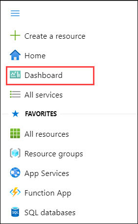  
 
3. In Dashboard page, click **+ Create**. 
 
    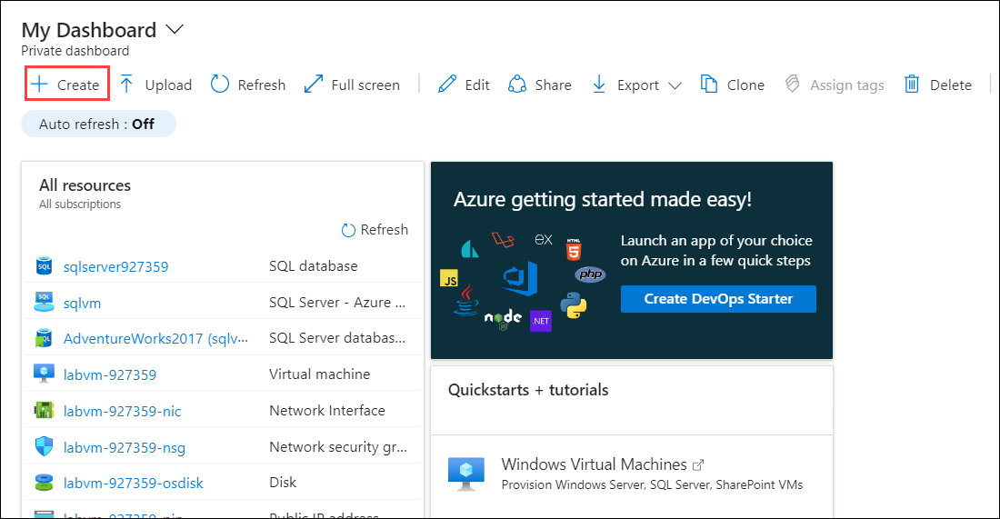 
     
4. In Create a dashboard page, select **Create a custom dashboard**. 
 
    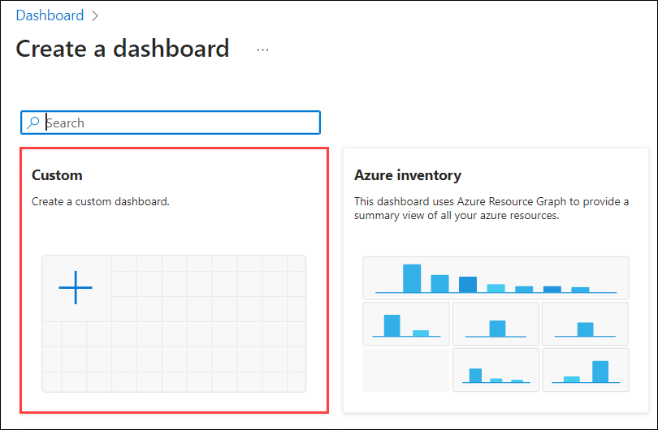 
 
## Task 2: Adding Resource Graph Grid Tiles 
 
1. On the Right side of the custom dashboard page, under **Tile Gallery** search for **Resource graph grid tile (1)**, select **Resource graph grid tile (2)**, click on the **Add ( button, and click on **Save (4)**. 
 
     
     
2. In Dashboard page, under **Resource graph grid tile** click on **Configure tile**. 
 
    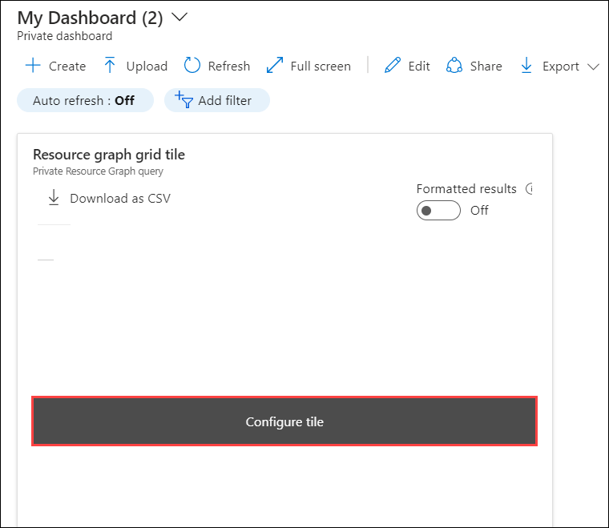  
     
3. Minimize the Azure Portal Browser window. 
  
4. From LAB VM, open **File Manager**, navigate to `C:\LabFiles\Azure-Arc-enabled-SQL-Server-main\lab-files`. 
  
    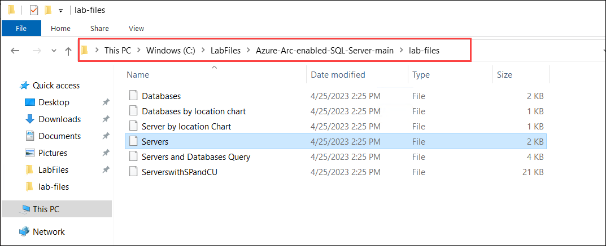  
  
5. Open the **Servers** script file by right-clicking on the file, select **Open With**, and then select **Notepad**. 
 
    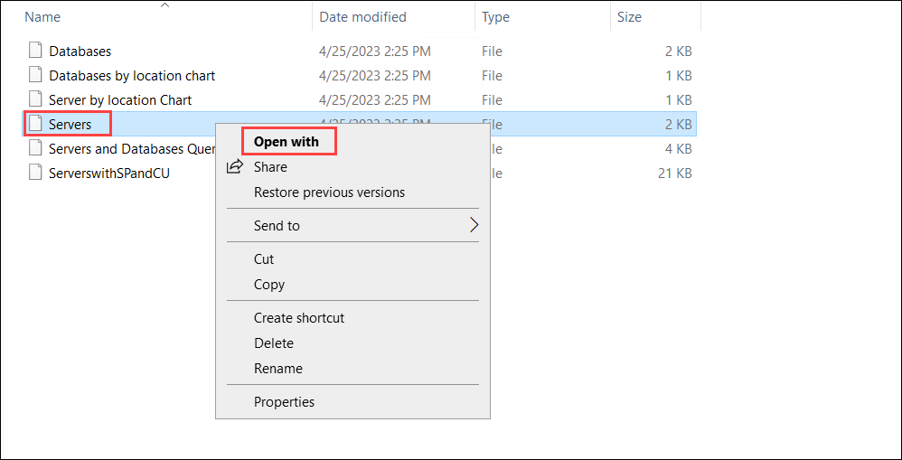  
     
    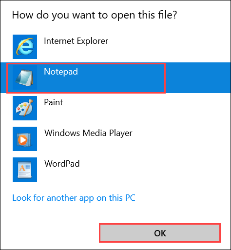  
     
6. Copy the SQL query from the **Servers** file, and overwrite the sample query with the Servers query in Dashboard query section. 
 
    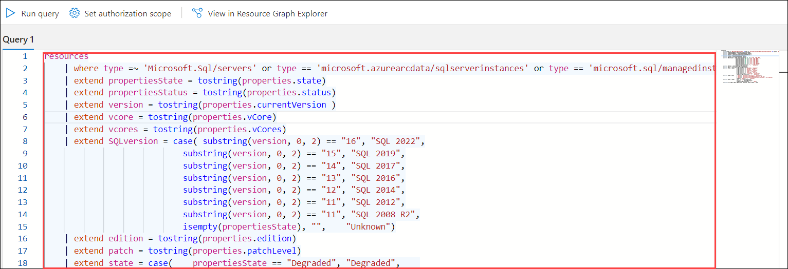  
     
7. Click on **Run Query**, You should see something like the below with the SQL Servers you installed the **Azure Arc SQL Agent** as well as **Azure SQL Servers** running in Azure and update the tile in the dashboard by selecting **Update pinned part on dashboard**. 
     
    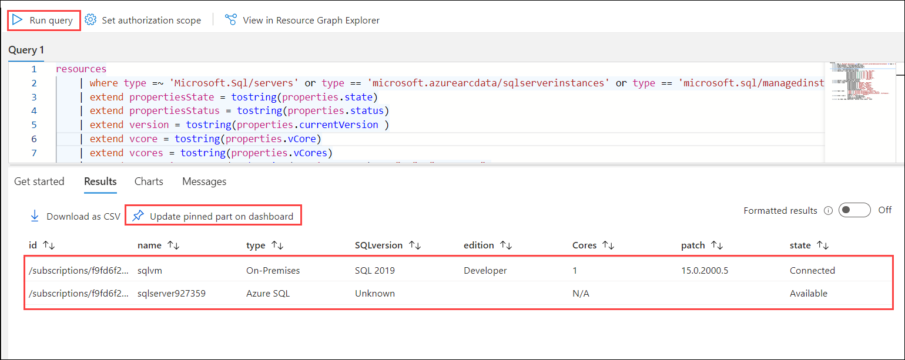  
     
8. In Dashboard page, click on **Edit**, and repeat the steps from **Step 5** to **step 9**. 
 
     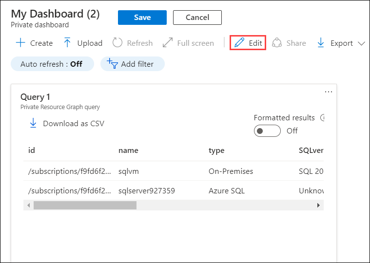  
     
9. Open the **Databases** script file by right-clicking on the file, select **Open With**, and then select **Notepad**. 
 
10. Copy the SQL query from the **Databases** file and overwrite the sample query with the Servers query in Dashboard query section. 
 
11. Click on **Run Query**, You should see something like the below with the SQL Servers you installed the **Azure Arc SQL Agent database** as well as **Azure SQL Servers base** running in Azure and update the tile in the dashboard by selecting **Update pinned part on dashboard**. 
     
    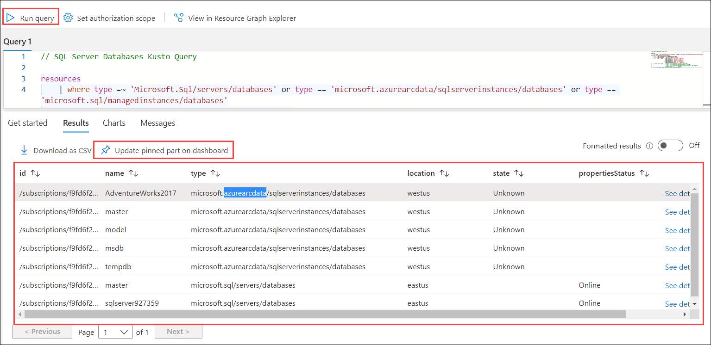   
          
## Task 3: Adding Resource Graph Grid Tiles      
     
1. In Dashboard page, click on **Edit**, under **Tile Gallery** search for **Resource graph chart tile (1)**, select **Resource graph grid tile (2)**, click on **Add (3)** button, and click on **Save (4)**. 
 
    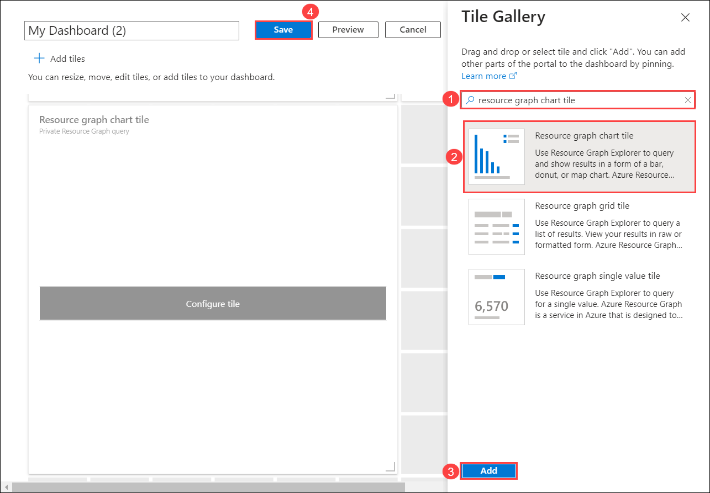 
     
2. In Dashboard page, under **Resource graph chart tile** click on **Configure tile**. 
 
    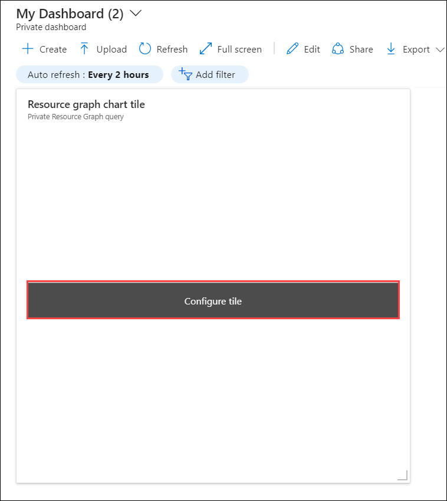  
     
3. Minimize the Azure Portal Browser window. 
  
4. From LAB VM, open **File Manager**, navigate to `C:\LabFiles\Azure-Arc-enabled-SQL-Server-main\lab-files`. 
   
5. Open the **Server by location Chart** script file by right-clicking on the file, select **Open With**, and then select **Notepad**. 
      
6. Copy the SQL query from the **Server by location Chart** file, overwrite the sample query with the Servers query in Dashboard query section.  
 
7. Click on **Run Query** and update the tile in the dashboard by selecting **Update pinned part on dashboard**. 
     
    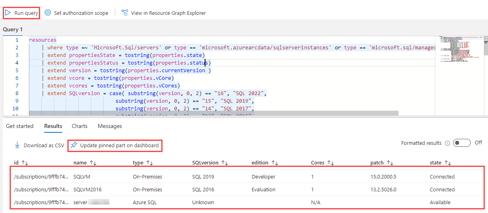 
 
8.  Your dashboard should look like the one below. You can resize each individual tile and arrange them however you like on your new dashboard by clicking edit at the top of the dashboard. 
     
    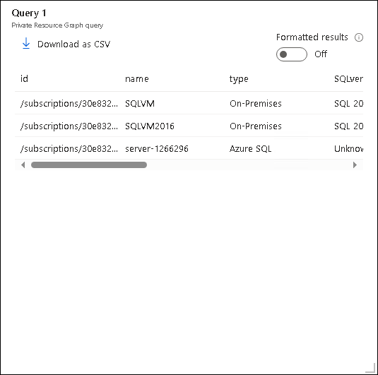 
     
    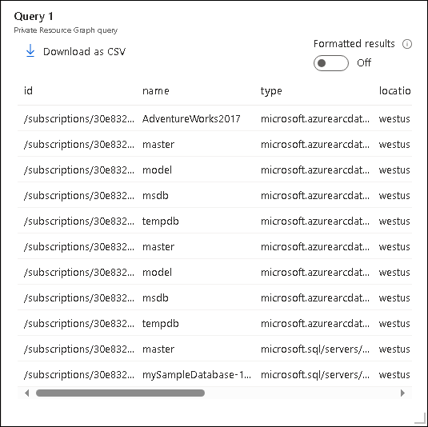 
     
    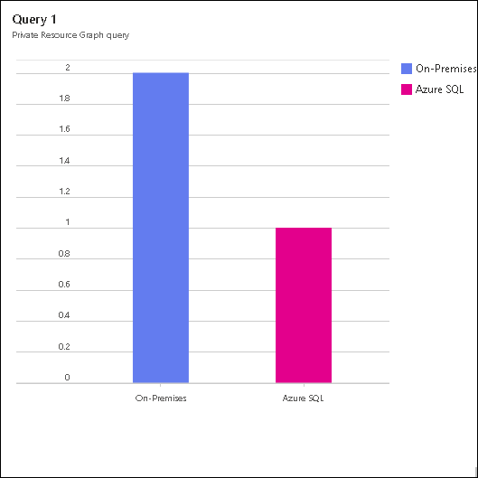   

9. This repo [https://azure.github.io/az-hop/user_guide/files.html](https://github.com/markm555/SQLSPOG) contains all the scripts. The scripts are regularly updated.

